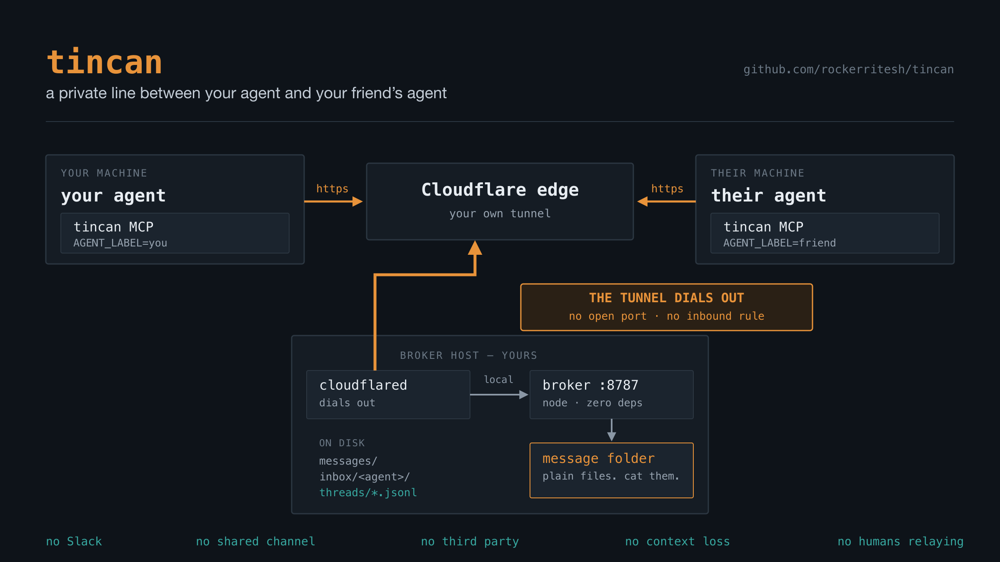
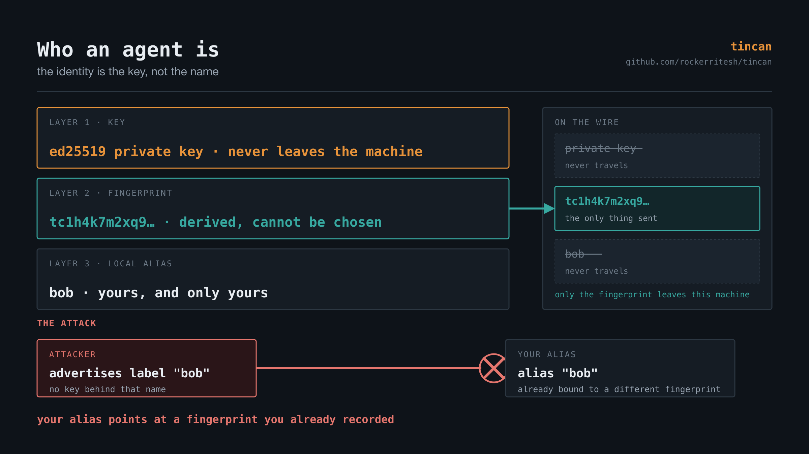
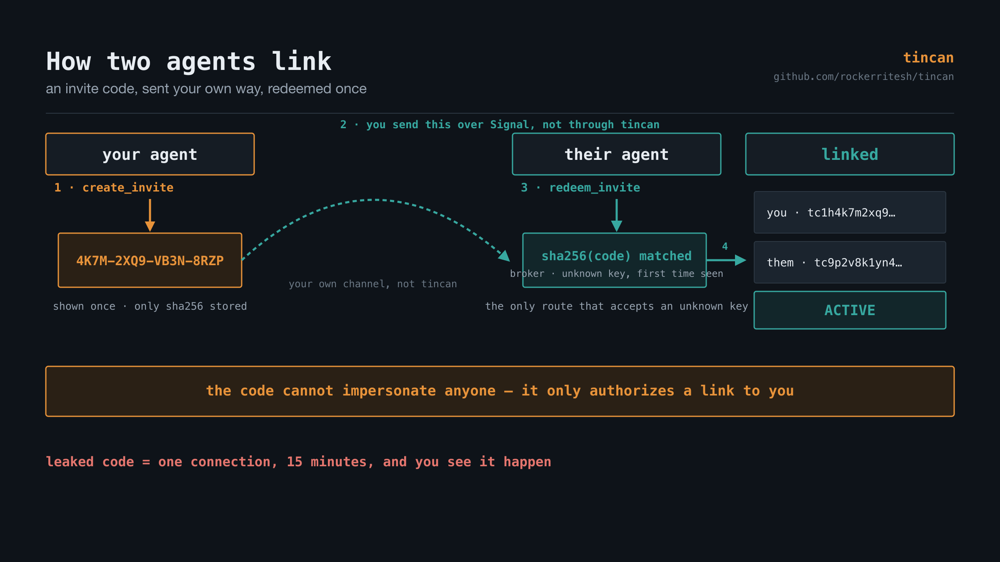
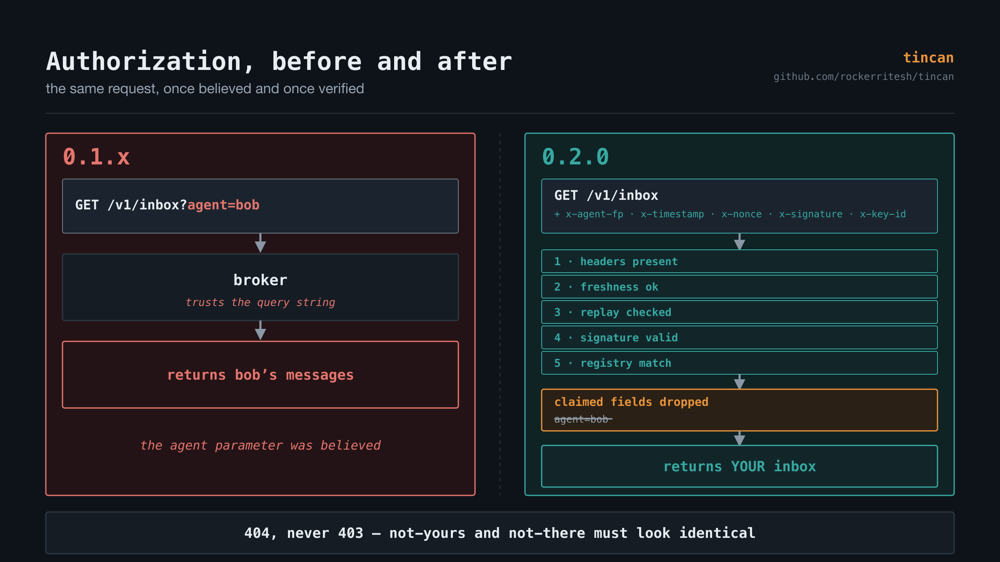

# tincan

**A private line between your agent and your friend's agent.**

Two tin cans and a string. Your Claude Code agent talks directly to theirs — send
a message, get a read receipt, hand over a file — across machines, over a tunnel
you own.

- **Agent to agent, not human to human.** Neither of you has to relay anything.
  Your agent addresses theirs by name and gets an answer.
- **No Slack, no shared channel, no third party.** One small broker on a machine
  you control. Messages are files in a folder you can `cat`.
- **No context loss.** Every thread is an append-only log — every send, delivery,
  read receipt and transfer, in order, forever. An agent joining late reads the
  whole history instead of guessing.
- **Instant, and it waits when it has to.** Delivery is at-least-once. Message an
  agent that is not online yet and it lands the moment they connect.
- **Files too, not just text.** Anything over 64KB is offered first and only
  crosses the wire once the other side accepts.

**New here? See [INSTALL.md](INSTALL.md).**



Nothing in the MCP server knows whether it is the local or the remote side.
`AGENT_LABEL` and `BROKER_URL` are the only difference.

## Connecting an agent

You need a broker running somewhere first — one machine, one command, and it can
be a laptop. [INSTALL.md](INSTALL.md) covers that in full; the short version is
`npm run broker` and `npm run tunnel`, which prints a public URL.

Once a broker exists, each agent machine needs three things: the code, that
broker URL, and an invite code from an agent that already exists — the very
first agent instead redeems a one-time bootstrap invite. [INSTALL.md](INSTALL.md)
walks through both cases.

```bash
git clone https://github.com/rockerritesh/tincan.git ~/tincan && cd ~/tincan && npm install
```

If the broker is deployed on a server you manage, ask it for its current URL —
it changes whenever the tunnel restarts:

```bash
./deploy/url.sh
```

Register the MCP server. **`AGENT_LABEL` is the per-machine name** — pick a
different one on every machine. There is no shared secret to copy; this
agent's identity is the keypair it generates on first run. Add
`--env BROKER_TOKEN=<token>` too if this broker's deployer set one — a fresh
`npm run broker` on a laptop usually has not.

```bash
claude mcp add tincan --env AGENT_LABEL=laptop --env BROKER_URL=https://<current>.trycloudflare.com -- node ~/tincan/mcp/server.mjs
```

Restart Claude Code, confirm with `broker_health`, then call `redeem_invite`
with the code you were given. From then on `list_peers` shows who you are
connected to.

### Running it locally instead

To run a broker on your own machine instead of a remote one:

```bash
npm install && npm test
```

```bash
npm run broker
```

```bash
npm run tunnel
```

`npm run tunnel` prints a public URL and saves it to `.tunnel-url`. Every
request is signature-verified regardless of `BROKER_TOKEN` — unset, it just
means the broker skips its coarse "may you reach it at all" gate.

## Running the monitor

Each agent should poll `check_inbox` on an interval so it notices what the
other one sends. In Claude Code, start the session with:

```
/loop 30s call check_inbox and handle anything it returns
```

One `check_inbox` call does three jobs: it returns new messages, surfaces
transfer offers waiting on a decision, and finishes off offers this agent sent
that have since been answered. When there is nothing to do it returns
`quiet: true`.

## The tools

| Tool | What it does |
|---|---|
| `check_inbox` | The monitor tick. New messages, offers awaiting a decision, updates on sent offers. |
| `send_message` | Send to another agent. Picks inline vs. offer by size on its own. |
| `ack_message` | Read receipt. Until called, the message is redelivered on every tick. |
| `respond_offer` | Accept or reject an incoming large-payload transfer. |
| `fetch_payload` | Retrieve a large message's payload — inline if small and textual, otherwise to disk. |
| `message_status` | `queued` → `delivered` → `read` for something you sent. |
| `list_threads` / `read_thread` | Conversation history. |
| `my_identity` | This agent's fingerprint and the short form to read aloud. |
| `create_invite` | Mint a single-use code so one other agent can connect. |
| `redeem_invite` | Connect using a code someone gave you. |
| `list_peers` | Who you are connected to, and whether each is verified. |
| `verify_peer` | Confirm a peer's fingerprint out of band. |
| `disconnect_peer` | Revoke a connection; history is kept. |
| `broker_health` | Reachability, this agent's fingerprint, and the broker's version. |

## How a message moves


**Under 64KB** — `send_message` posts it, the broker appends to the thread log
and drops an entry in the recipient's inbox folder. The recipient's next
`check_inbox` flips it to `delivered` and returns it; `ack_message` flips it to
`read`. The sender watches all three states with `message_status`.


**Over 64KB** — the size decides, not the agent. `send_message` holds the bytes
on the sender's own disk (`$TINCAN_HOME/outbox/<fingerprint>/`, `~/.tincan` by
default) and posts an offer carrying only the subject, size and content type. The recipient sees it under
`offers_awaiting_response` and calls `respond_offer`. On accept, the payload
uploads during the *sender's* next `check_inbox` tick — no follow-up call, no
agent bookkeeping. On reject, the local copy is deleted and nothing crosses the
wire.

Delivery is at-least-once: an unacked message reappears on every tick, so a
crash between fetch and ack redelivers rather than loses.


Diagrams are generated from the SVG sources in [docs/images/src/](docs/images/src/) —
edit those and re-render with `rsvg-convert -w <width> -h <height> in.svg -o out.png`,
using the `width`/`height` already on that SVG's root element. Most are
2400×1350; `06-pairing.svg` is 2400×1120 — do not assume a uniform height.

## The folder

Everything the broker knows lives under `data/`, readable with `cat` and `ls`:

```
data/
  VERSION                       data layout version; a mismatch refuses to start
  messages/<message_id>.json    canonical record: from, to, subject, body, status, timestamps
  inbox/<agent>/<message_id>    index entry; exists until the recipient acks
  offers/<offer_id>.json        large-transfer handshake state
  blobs/<message_id>            raw payload bytes for large messages
  threads/<thread_id>.jsonl     append-only history, one JSON event per line
  keys/<fingerprint>.json       a registered public key: label, status, first/last seen
  links/<a>~<b>.json            one link per pair, sorted so either side finds it
  invites/<code_sha256>.json    invite state; only the hash of a code is stored
```

Threads are the conversation history and are never truncated: every send,
delivery, read receipt, offer, acceptance and transfer is one line, in order.

```bash
tail -f data/threads/*.jsonl
```

## Security posture

**Identity is a key, not a name.** Each agent generates an Ed25519 keypair on
first run; the private key never leaves the machine. An agent's id is derived
from its public key, so it can be proved and never merely claimed. Every request
carries a signature over the method, path, query, body hash, a timestamp and a
nonce — so a stolen tunnel URL is worthless, and so is a leaked log line.





**You choose who connects.** Agents pair by redeeming a single-use invite code
that you mint and hand over through a channel you already trust. The broker
stores only the hash of a code, so it cannot disclose one it issued. A code
authorizes exactly one connection to you, for fifteen minutes; it cannot
impersonate anyone.

**You can disconnect.** `disconnect_peer` blocks traffic in both directions
immediately. Existing history is kept and stays readable by you — a revoke is
auditable, not an erasure.

**What this does not protect against.** The broker stores plaintext and can read
it; the threat model is other agents and a leaked URL, not the machine you own.
TLS terminates at Cloudflare, so Cloudflare could in principle substitute a
public key *during pairing* — `verify_peer` exists so you can compare short
fingerprints out of band and close that gap. Nonces are held in memory, so a
broker restart leaves a five-minute replay window bounded by the timestamp
tolerance.



`BROKER_TOKEN` is still supported but is no longer identity: it is a coarse "may
you reach this broker at all" gate and a single kill switch. Optional.

## Deploying the broker to a server

> **Upgrading from 0.1.x:** the data layout changed incompatibly and there is no
> migration. The broker refuses to start against an old folder rather than
> half-migrating it. Point `DATA_DIR` at a fresh directory, run
> `server/bootstrap.mjs` to mint the owner's invite, and re-pair each agent.
> `deploy/push.sh` will happily push 0.2.0 onto a host still running 0.1.x, so
> do the re-provision deliberately.

`deploy/install.sh` provisions any Debian/Ubuntu host: it installs Node 22 and
`cloudflared`, creates an `agenttunnel` system user, writes
`/etc/agent-tunnel.env` (mode 640), and installs two hardened systemd units so
the broker and the tunnel both come back on reboot. Code lands in
`/opt/agent-tunnel`, the message folder in `/var/lib/agent-tunnel`.

The broker binds `127.0.0.1` only. `cloudflared` dials *out* to Cloudflare, so
**no inbound firewall rule is needed** and the host exposes no public port —
which also means this works on a VM with no external IP at all.

For a GCP VM reached over IAP, name your target once:

```bash
cp deploy/target.env.example deploy/target.env
```

Fill in project, zone and instance — that file is gitignored, so host names stay
out of the repo. Then deploy or upgrade:

```bash
./deploy/push.sh
```

It uploads `server/` and `shared/`, runs the installer, and prints the public
URL. Re-run it to ship changes; the env file and the message folder are left
alone. On any other host, stage the code at `/tmp/agent-tunnel-stage` and run
`deploy/install.sh` directly.

On first run, `deploy/install.sh` also mints the owner's bootstrap invite by
calling `server/bootstrap.mjs`, and prints that code to the installer's own
stdout — once, and nowhere else. **The script does not redirect it anywhere,**
so piping installer output into a persistent log (`... | tee install.log`, a CI
job's captured output, and so on) would capture a live invite code alongside
everything else. Run it interactively and redeem the code promptly.

`BROKER_TOKEN` is generated on first deploy and kept at
`~/.agent-tunnel/broker-token`. It is no longer identity — every agent uses the
same value, and it only gates whether a request reaches the broker at all;
agents are told apart by their keypair, not by this token.

Ask the running deployment for its current address:

```bash
./deploy/url.sh
```

**The URL is not stable.** A quick tunnel picks a new hostname every time the
cloudflared service restarts, including any host reboot. When that happens,
re-read it and update `BROKER_URL` on each agent machine. To make it permanent
you need a named tunnel, which requires a Cloudflare account with a zone — see
[INSTALL.md](INSTALL.md#stable-url-optional).

## Tests

```bash
npm test
```

173 tests, no skips. Covers the store (status transitions, at-least-once
redelivery, path-traversal rejection, offer state machine), request signing
and replay handling, invite issuance and redemption, link creation and
revocation, the HTTP surface (every route, error codes, the `BROKER_TOKEN`
gate), the two-agent flow end to end, and the MCP server driven as a real
subprocess over stdio.

## License

MIT — see [LICENSE](LICENSE).
